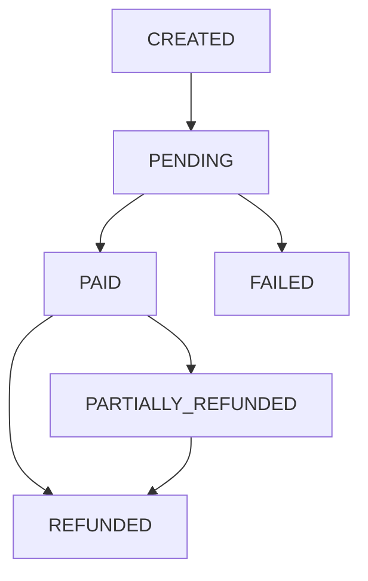

# Módulo de Pagos y Contabilidad (`Payments`)

El sistema de pagos de DPapp es una pieza crítica diseñada bajo principios de integridad financiera, utilizando una máquina de estados finitos (FSM) y contabilidad de partida doble.

## Arquitectura de Pagos

El flujo es gestionado por el `PaymentOrchestrator` (`src/lib/payments/orchestrator.ts`), que centraliza el procesamiento de cobros nativos e internos.

### 1. Gateway Nativo
DPapp actúa como el recaudador de fondos, eliminando la necesidad de que los comercios mantengan sus propias llaves de API externas. Esto garantiza una experiencia de usuario fluida y una liquidación de fondos centralizada.

### 2. Libro Mayor (Ledger)
Cada evento financiero genera una transacción en el Ledger (`src/lib/payments/ledger.ts`) siguiendo el modelo de partida doble (Debits + Credits = 0).

**Ejemplo de Venta ($10.000 con 8% comisión):**
- **DEBIT** `psp_pending`: $10.000 (Activo en el procesador)
- **CREDIT** `payoutable_balance`: $9.200 (Pasivo con el comercio)
- **CREDIT** `platform_commissions`: $800 (Ingreso de la plataforma)

### 3. Idempotencia y Seguridad
- **Claves de Idempotencia**: Generadas a partir del hash de `store+order+amount+currency`. Esto previene cobros duplicados ante fallos de red.
- **Deduplicación de Webhooks**: Cada evento de proveedor se procesa exactamente una vez.
- **Financial Guards**: Limitan el monto de transacciones individuales y la velocidad de reembolsos para prevenir fraude.

## Reembolsos (Refunds)

El sistema soporta reembolsos totales y parciales con controles de seguridad adicionales:
- **Dual Control**: Reembolsos de alto valor (> $1M) son retenidos automáticamente para revisión manual (`PENDING_APPROVAL`).
- **Invariante de FSM**: El sistema prohíbe reembolsar un monto mayor al originalmente pagado.

## Proveedores (PSP)

DPapp soporta:
- **Stripe**: Integración nativa con Connect para cobro de comisiones automáticas.
- **MercadoPago**: Popular en LatAm.
- **Transbank (Webpay)**: Estándar en Chile.

> [!CAUTION]
> Nunca manipules el `status` de un `PaymentIntent` directamente en la base de datos. Utiliza siempre los métodos del `PaymentOrchestrator` para asegurar que se disparen las entradas contables correspondientes.
